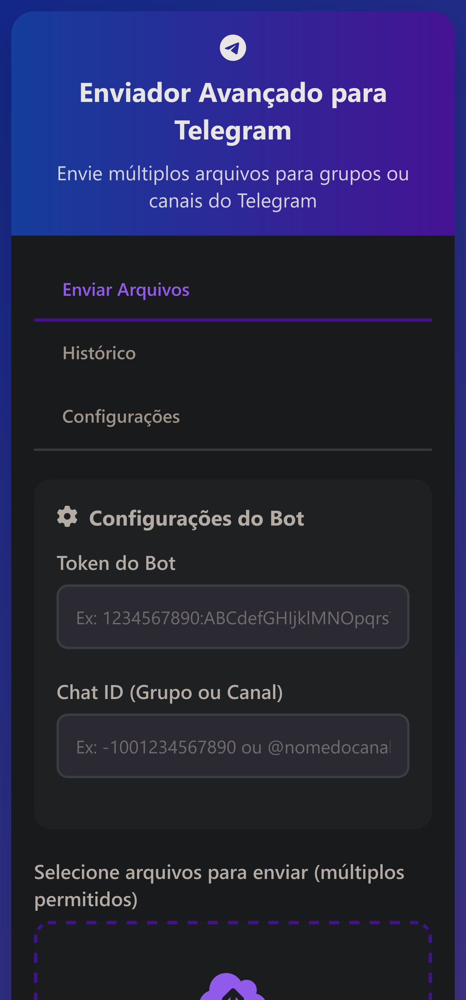

# 📤 Telegram File Sender

<div align="center">


Uma aplicação web para enviar arquivos para o Telegram diretamente do navegador.

**🚀 Demo Online:** [https://seu-usuario.github.io/telegram-file-sender/](https://seu-usuario.github.io/telegram-file-sender/)

</div>

## ✨ Funcionalidades

- ✅ **Envio múltiplo** - Envie vários arquivos de uma vez
- 📱 **Responsivo** - Funciona em desktop e mobile
- 🔄 **Drag & Drop** - Arraste e solte arquivos
- 📊 **Barra de progresso** - Acompanhe o envio em tempo real
- 📝 **Histórico** - Registro completo de todos os envios
- ⚙️ **Configurações** - Personalize o comportamento
- 🎯 **Preview de imagens** - Visualize antes de enviar
- 🔒 **Local Storage** - Salva configurações automaticamente

## 🚀 Como Usar

### 1. Obter Token do Bot
1. Converse com [@BotFather](https://t.me/BotFather) no Telegram
2. Crie um novo bot ou use um existente
3. Copie o token fornecido

### 2. Obter Chat ID
- **Grupos**: Adicione [@raw_data_bot](https://t.me/raw_data_bot) e copie o "id"
- **Canais públicos**: Use @nomedocanal
- **Canais privados**: Adicione o bot como administrador

### 3. Enviar Arquivos
1. Cole o token e chat ID
2. Selecione os arquivos (ou arraste e solte)
3. Adicione uma legenda (opcional)
4. Clique em "Enviar para o Telegram"

## 🖥️ Capturas de Tela

<div align="center">
  
  
</div>

## 🛠️ Tecnologias

- **HTML5** - Estrutura semântica
- **CSS3** - Estilização moderna e responsiva
- **JavaScript (ES6+)** - Lógica e interatividade
- **Font Awesome** - Ícones
- **LocalStorage API** - Persistência de dados
- **Telegram Bot API** - Comunicação com Telegram

## 📦 Instalação Local

```bash
# Clone o repositório
git clone https://github.com/seu-usuario/telegram-file-sender.git

# Entre na pasta
cd telegram-file-sender

# Abra no navegador
# Não requer servidor - abra direto o index.html
